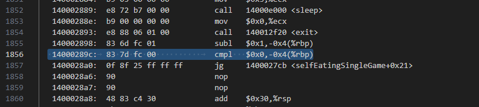

### Дизассемблирование при помощи objdump.

### Поиск необходимой функции в редакторе.

### Принято решение сломать цикл for при поиске совпадений головы змеи и каждым элементом ее хвоста. Т.е. делаем так, что бы условия цикла не выполнялись.

### Меняем значение условия команды cmpl с 00 например на 10 .

### Результат.

